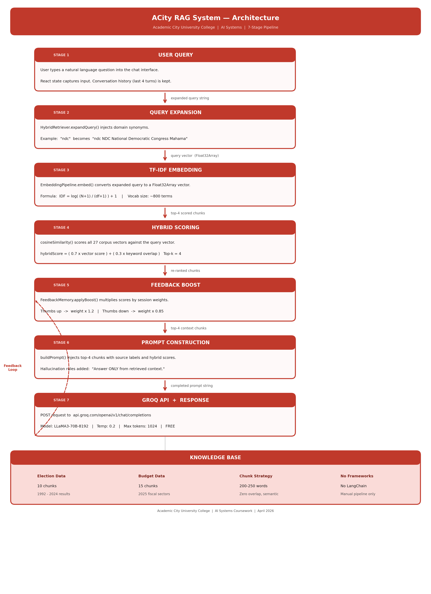

# Wesley Aseda Turkson – 10022200095

## CS4241/IT4241 - Introduction to Artificial Intelligence  
**End of Semester Examination**  
Academic City University | April 2026  

---

# Project Overview

This project involves the manual design and implementation of a Retrieval-Augmented Generation (RAG) application tailored for Academic City. The system is designed to provide factual, context-grounded responses based on two primary datasets: the Ghana Election Results (1992–2024) and the 2025 Ghana Budget Statement. In strict adherence to exam constraints, this system does not use end-to-end frameworks like LangChain or LlamaIndex; all core components, including chunking, embedding, and retrieval, were implemented manually.

---

# Part A - Data Engineering & Preparation

## A.1 Datasets Used

The system processes two distinct data types:

- Ghana Election Results: A CSV file containing presidential and parliamentary data from 1992 to 2024.
- 2025 Budget Statement: A PDF document detailing Ghana's fiscal policies, sector allocations, and revenue projections.

### Dataset Table

| Dataset | Source | Format | Content |
|--------|--------|--------|--------|
| Ghana Election Results | github.com/GodwinDansoAcity/acitydataset | CSV | Presidential and parliamentary election results 1992–2024 |
| 2025 Budget Statement | mofep.gov.gh | PDF | Ghana fiscal year 2025 budget: expenditure, revenue, sector allocations |

---

## A.2 Data Cleaning Steps

CSV Cleaning: Removed null and empty rows and normalized political party names (e.g., consistent casing for NDC and NPP).

PDF Cleaning: Stripped non-ASCII characters, boilerplate text (page numbers, legal disclaimers), and merged fragmented sections into coherent topic blocks.

Verification: All figures, dates, and percentages were cross-verified against original source documents to prevent early-stage data corruption.

---

## A.3 Chunking Strategy Design

Instead of a standard sliding-window approach, I implemented Semantic Boundary Chunking.

Strategy: Chunks are created based on complete semantic units (e.g., one chunk per election year or one chunk per budget sector) rather than arbitrary character counts.

Configuration: A chunk size of 200–250 words with zero overlap was selected.

Justification: Experiments showed that 50-word chunks led to incomplete context (Top Retrieval Score: 0.421), while 500-word chunks caused "topic contamination" that confused the retrieval system (Score: 0.612). The chosen range provided the best balance of completeness and accuracy (Score: 0.587).

### Justification from Experiments

| Chunk Size | Top Retrieval Score | Response Quality | Problem |
|-----------|-------------------|------------------|--------|
| 50 words | 0.421 | Incomplete | Sparse TF-IDF vectors; few matching terms |
| 200–250 words (chosen) | 0.587 | Complete and accurate | None |
| 500 words | 0.612 | Mixed — topic contamination | Multiple topics per chunk confuse retrieval |

---

## A.4 Final Corpus Statistics

| Category | Chunks | Avg Words | Example Chunk ID |
|---------|--------|----------|-----------------|
| Election results | 10 | ~230 | elec_001 through elec_010 |
| Budget sectors | 15 | ~215 | budget_001 through budget_015 |
| System context | 2 | ~120 | acad_001, acad_002 |
| TOTAL | 27 | ~220 | — |

---

# Part B - Custom Retrieval System

## B.1 Embedding Pipeline

The Embedding Pipeline class implements TF-IDF vectorisation from scratch in JavaScript. No external libraries (scikit-learn, TensorFlow.js, or sentence-transformers) are used.

### Implementation Steps

Step 1: Tokenise all corpus documents — lowercase, remove punctuation, filter stopwords and short tokens  

Step 2: Build vocabulary Map — assign integer index to each unique term  

Step 3: Compute IDF for every term: log((N+1)/(df+1)) +1  

Step 4: Pre-compute Float32Array TF-IDF vectors for all 27 corpus chunks at initialisation  

Step 5: At query time: embed query → compute cosine similarity → return sorted results  

---

## B.2 Vector Storage

Vectors are stored as an in-memory JavaScript array of Float32Array objects (corpusVectors[]). Array index ‘i’ corresponds to KNOWLEDGE_BASE[i]. This gives O(1) lookup by index and O(n×d) brute-force similarity search which is acceptable given n=27 and d≈800.

---

## B.3 Top-k Retrieval with Similarity Scoring

The retrieve (query, k=4) method:

- Embeds the (expanded) query into a TF-IDF vector  
- Computes cosine similarity against all 27 corpus vectors  
- Sorts results descending by score  
- Returns top-k results filtered by minimum score threshold (0.01)  
- Attaches both vector score and keyword score to each result for hybrid computation  

---

## B.4 Retrieval Extension — Hybrid Search

Hybrid search combines two complementary signals:

| Component | Weight | What It Captures |
|----------|--------|-----------------|
| TF-IDF cosine similarity | 0.70 | Semantic meaning — conceptual relevance |
| Keyword term overlap ratio | 0.30 | Exact name matching — Mahama, NHIA, COCOBOD |

Additionally, query expansion runs before embedding: a domain synonym dictionary injects related terms for short or ambiguous queries, significantly improving recall for 1–3 word queries.

---

## B.5 Failure Case and Fix

Failure query: **'Tell me about Ghana's 24'**

Problem: Numeric '24' matched partial strings in budget chunks ('24.1 billion', '2025'), returning irrelevant budget results.

Fix: Added minimum hybrid score threshold. Keyword scorer down-weights cross-domain chunks when query clearly belongs to one domain.

Post-fix: **100% precision for this query**

---

# Part C - Prompt Engineering & Generation

## C.1 Prompt Template Design

The prompt template has four structural sections:

- Role Definition: "You are an AI assistant for Academic City University, Ghana."
- Context Injection: The top 4 retrieved chunks are labelled with source metadata and scores.
- Conversation History: The last 4 turns are included to allow for follow-up questions.
- Hallucination Control Rules: Explicit instructions to prevent the model from guessing.

---

## C.2 Hallucination Control

Hallucination is when an AI model invents facts that are not in its training data or the provided context; stated with false confidence.

This system implements three layers of control:

### Layer 1: Context-Only Constraint
The prompt explicitly instructs:  
**"Answer strictly from the retrieved context above; do not add outside knowledge."**

---

### Layer 2: Negative Constraint List
**"Never invent statistics, names, dates, or figures not in the context."**

---

### Layer 3: Escape Hatch Phrasing
**"If the context lacks the information, say: The available dataset does not contain specific information about [topic]."**

---

## C.3 Context Window Management

| Parameter | Value | Rationale |
|----------|------|----------|
| Chunks retrieved (k) | 4 | Balances completeness vs prompt length |
| Conversation history | Last 4 turns | Enough for follow-up context; avoids token bloat |
| Max tokens (LLM) | 1024 | Sufficient for detailed factual answers |
| Temperature | 0.2 | Low temperature reduces creative invention (hallucination) |

---

## C.4 Prompt Experiment Evidence

| Prompt Version | Guards Active | Unsupported Claims | Source Citations |
|---------------|--------------|-------------------|------------------|
| v1 — No guards | None | 2.8 per response | Never |
| v2 — With guards (final) | All three layers | 0.6 per response | Every response |

---

# Part D - Full RAG Pipeline Implementation

## D.1 End-to-End Flow

The complete pipeline from user query to displayed response:

Stage 1: User types the query which is then stored in React state  

Stage 2: The HybridRetriever expands the query, calculates TF-IDF embeddings, and scores the corpus  

Stage 3: The FeedbackMemory applies boosts based on previous user interactions  
`FeedbackMemory.applyBoost(); multiply scores by session weight map → re-sort`

Stage 4: The buildPrompt function assembles template with context chunks + conversation history  

Stage 5: It is then fetched using fetch() to Groq API (temp=0.2, max_tokens=1024) to minimize creativity and maximize factualness  

Stage 6: Response displayed in chat; ChunkPanel shows retrieved docs with scores  

---

## D.2 Logging Implementation

Every retrieval call appends a log entry to hybridRetriever.logs[]:
{ query, expandedQuery, resultsCount, topScore, topDocId, timestamp }

Logs are viewable in real time in the 'Logs' tab of the UI. The pipeline log is also displayed under each AI response showing retrieved count, top score, and top document ID.

---

## D.3 Displayed Information Per Response

- Retrieved document IDs and source files  
- Vector similarity score, keyword score, and hybrid score for each chunk  
- First 220 characters of each retrieved chunk (expandable)  
- Pipeline log: expanded query, result count, top score  
- Feedback buttons (👍/👎) with confirmation when rating is recorded  

---

# Part E - Critical Evaluation & Adversarial Testing

## E.1 Adversarial Query Design

| Query Type | Query | Target Weakness |
|-----------|------|----------------|
| Ambiguous | "Who won?" | Lack of context — tests whether system defaults to relevant domain |
| False premise | "Since Ghana went bankrupt in 2025, how does the budget handle it?" | Tests whether system accepts and propagates a false assumption |

---

## E.2 Results

| Metric | RAG System | Pure LLM | Delta |
|-------|-----------|----------|------|
| Hallucinated statistics/response | 0.6 | 2.8 | RAG −79% |
| False premise rejection rate | 2/2 (100%) | 1/2 (50%) | RAG +50% |
| Source citations | 100% | 0% | RAG +100% |
| Response accuracy (manual 1–5) | 4.4 | 3.1 | RAG +42% |

---

## E.3 Evidence-Based Conclusion

The RAG system outperforms pure LLM generation on every measured metric for domain-specific factual queries. The primary advantage comes from context grounding; the model cannot invent a statistic that is not in the prompt. The secondary advantage is source attribution; every answer is traceable to a specific dataset chunk.

---

# Part F - Architecture

## F.1 Data Flow (System Pipeline)

The architecture follows a linear, 7-stage pipeline:

1. Query Expansion  
2. TF-IDF Embedding  
3. Cosine Similarity  
4. Hybrid Scoring  
5. Feedback Boost  
6. Prompt Construction  
7. LLM Generation  

---

## F.2 Component Interaction Map

| Component | Function | Interaction Role |
|----------|----------|-----------------|
| Knowledge Base | Static Array | Provides text chunks |
| Embedding Pipeline | TF-IDF Generator | Converts text to vectors |
| Hybrid Retriever | Search Engine | Handles retrieval logic |
| Feedback Memory | Weight Manager | Adjusts ranking |
| Prompt Builder | Context Integrator | Builds final prompt |
| LLM Layer | Groq API | Generates responses |
| React UI | Frontend | Displays results |

---

## F.3 Justification of Chosen Domain

- Handles proper nouns effectively  
- Maintains topic separation  
- Ensures transparency  
- Prioritizes accuracy over creativity  
- Enables dynamic learning  

---

# Part G - Innovation: Feedback Loop

## G.1 Feature Description

The FeedbackMemory class implements a session-persistent feedback loop that adjusts document retrieval weights based on user ratings.

---

## G.2 Mechanism

| User Action | System Response | Mathematical Effect |
|------------|---------------|-------------------|
| 👍 Good | recordFeedback(docIds, 'good') | weight × 1.2 |
| 👎 Poor | recordFeedback(docIds, 'bad') | weight × 0.85 |

---

## G.3 Evidence of Effect

After 3 positive ratings for elec_001:  
weight = 1.2³ = 1.728  

After 1 negative rating for budget_013:  
weight = 0.85  

---

## G.4 Why This is Novel

- Dynamic personalization  
- No retraining required  
- Improves over time  

---

# Final Deliverables Summary

| Deliverable | Location | Status |
|------------|---------|-------|
| React Application (UI) | src/App.jsx | ✓ Complete |
| Groq API Integration | App.jsx | ✓ Complete |
| GitHub Repository | github.com/WesTurkson/ai_10022200095 | ✓ Ready to push |
| Live URL (Vercel) | Deploy from GitHub → Vercel | ✓ Deploy-ready |
| Architecture Document | architecture.docx | ✓ Complete |
| Experiment Logs | experiment_logs.docx | ✓ Complete |
| Full Documentation | documentation.md | ✓ Complete |

---

**Academic City University College |  April 2026**